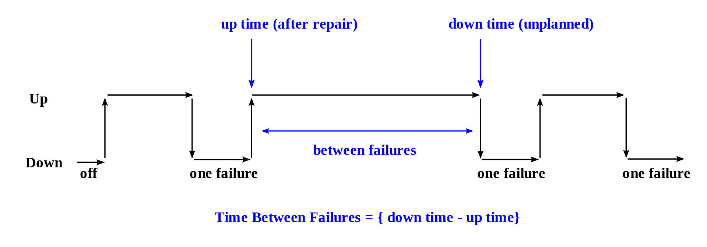
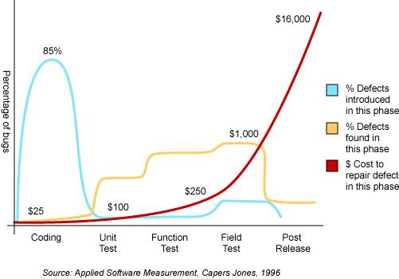

数据库打工仔在擦拭枪支时，喃喃自语的八卦历史

# 八卦（二）：可靠性 - 数据库篇

一个软件工程师, 枪支爱好者，历史八卦者的喃喃自语

## 数据库的可靠性 
### 1. 数据库里的老枪 - Db2 for zOS
系统RAS(Reliability, availability and serviceability)概念最早是由IBM提出[[1]](#1)来形容曾经是神一样存在的主机（也叫大机，mainframe)。为什么说神一样的存在呢？主机是第一批商用计算机，1950出现，活跃至今，最新版本为2019.9月的z15。最早的一批商用数据库就包括主机上的DB2/z(1983年GA v2.3)。也许你从没有听说过，但是如果你每一天在消费，过程中，不论银行卡，支付宝，微信都会最终走到银联，而且很可能是工农建交等大银行，那么你的交易就是在主机上完成和记录的。

最近的AWS Re:Invest有一个session, 讲[AWS Mainframe Modernization](https://aws.amazon.com/about-aws/whats-new/2021/11/introducing-aws-mainframe-modernization/); 这个一周前的公告[8.38 亿元、中国银行单一来源采购：IBM z15主机](https://mp.weixin.qq.com/s/tESsQr1w_-hzkj9YZ5Wthg) 也可见一斑

**神在我们身边默默的存在，不打扰一片云彩**

我们谈论数据库的可靠性时候，笼统的时候会泛指RAS，大部分时候单指Reliability。

- **可靠性**Reliability: 数据库系统无故障可以持续运行的能力。MTBF(Mean Time Between Failure)/MTTF(Mean Time to Faillure)，MTTR(Mean Time to Repair/Recover)。这些都是工业界通用的衡量标准。具体计算公式大家自己去Google/wiki。这里盗个图凑数

<!--
- **可用性**Availability：系统在指定时间内可正常工作的概率。
  比如说云原厂上经常会提到的SLA，N个九。近是十年流行的“双活”，“两地三中心”等等方案都是提高可用性的最佳实践方案。
- **可维护性**Serviceability：若故障发生，检查和维修需要的时间
-->
### 2. 如何保证可靠性

教科书里有很多，架构设计的书也可以轻而易举的找到。本文既然是八卦篇，就只分享现实世界的事情。那些**理论上**支撑的功能，**原则上**不会宕机的架构设计不是这里的重点

怎么能不犯错？do nothing; 要保证软件不出bug? 一行不写。如果不得不code呢？可靠方面先思考这两项

#### 2.1 核心代码的复杂度

架构设计有个说法K.I.S.S(Keep it Simple, Stupid!)。其实系统软件的核心code, 扬名天下立万的骨架，也就那么几万行，完成系统80%的工作，换句话说，系统连续运行过程中每小时（甚至每分钟）都必然运行的code logic。这些code中简洁易懂是系统存活的关键。

**简洁**可减少系统的bug。MySQL依赖最简单可靠的nest-loop join算法二十多年，而"先进"的Hash Join是在最近两年才实现，在MySQL8.0.18正式GA。从算法复杂度看(两个都有改进版本)，[Nest Loop J](https://en.wikipedia.org/wiki/Nested_loop_join)是O(MN), [Hash J](https://en.wikipedia.org/wiki/Hash_join)是O(M+N)。Hash join 在教科书里属于advance的章节，直接翻译是“进步”，褒义词。可是另一方面，几乎所有的advance技术都更复杂(电车是个反例，降维打击了），需要更多或更特殊的资源才能发挥其能力。Hash Join就需要在大内存支持下才能发挥，否则要么OOM，要么落盘造成性能断崖，尤其不适合高并发的TP场景。比如各位同学中午在食堂买饭，就是高并发场景，如果系统中突然出现一个大查询把内存都吃掉，也把各位的饭就吃掉了。如何解决这个问题呢？workload management(WLM) 就要被引入，以自动调低“烂”query的优先级，限制其资源。而又引入进一步的系统复杂度。nest loop保证了每个join的内存空间消耗是固定的，所以在上面场景中，不用WLM，不用系统DBA也可以保证各位吃上午饭。

给我自己顶个锅盖保护一下，绝没有想引战NLJ vs HJ的意思，PG有比较完整成熟的优化器，就好很多。靠，又引战MySQL vs PG 了。

只是想说，如果一个系统可以简单化，就可以减少其bug数，增加可靠性。当然，我猜50%以上的人也不是因为对数据库有兴趣才读这个文章吧？同不同意的，大家都忽略呀。

有兴趣研究软件工程的东西，可以看看Unix philosophy。哲学的事情咱不懂，用数据说话，第一版Unix据称是不到5千行的汇编语言；linux 0.0.1版是10243 line of code(C) 和386LoC(汇编)。多年前，我参与系统软件项目排期的时候，是按1.5KLoC/Person-Year 做的计划。所以偶尔听说系统开发同学谈绩效的时候提一年几万行代码，还经常是早春二三月份提交的，兄弟我怕呀。前端同学代码量会多些，不过这些代码的生命力会差些。其实我认为衡量一个开发的代码能力不应简单的line of code, 应该与服务年挂勾

<!-- 华为：圣无线，神终端，海屌丝，大爷软，科学家  -->

#### 2.2 测试

这方面经常在数据库设计和实现过程中被忽略，尤其在相对不成熟的开发团队中
只做简单的功能测试，甚至是单逻辑flow，而不考虑边界条件，更谈不上系统压力测试(system stress testing)。比如说连接数/concurrency突然提升情况下，是否还能够保证吞吐量和延时保持着正常水平，而不会因为高压力下造成系统完全不可用。

写code就会有bug, 越早发现fix的成本约少。软件工程中这张图是1996s的文章。每每在前线客户反馈一个简单的bug, 我脑海里就是这张图和16000美刀

鄙视链那都有，软件开发也不例外，常常一方面说测试多么重要，一方面测试工程师的工资级别属于末端集结号。自然没有牛人过来投入。这是全球普世的，而某些团队尤甚。尤其是近些年，开始学Agile，学开源，甚至不设测试岗位。殊不知，开源社区最注重测试，测试代码量常常是产品代码的3X。笔者有幸十年前在HBase社区打酱油，很是佩服一个健康社区对代码质量的管理。而当时的主席Stack，自号HBase Janitor（清洁工），最重要的工作就是QA。

试问你所在的团队，产品发布时，最后的否决权是否在测试手里？猪肉出厂还要盖个质检章呢。如果客户现场发现了一个bug, 你的团队的复盘中，是否能确认这个bug应该在软件工程的那个环节被发现？

### 3. 结语

一个系统的可靠性（其实是系统的各个方面了）是从三方面完成的：

1. 系统的**架构设计** - 对于大部分软件工程师这一点上不需要太重视， 为什么呢？因为像数据库有历史，它的基本架构就那么几种（single-node/monolithic, shared-storage/everything, shared-nothing)， 架构带来的优势和劣势已经被无数学术论文讨论和工业系统验证过。我们99.9%都人是在前人肩膀上讨生活的。
2. 系统的**实现** - 也就是code。同样打个桌子，朱由校（明熹宗）很可以超越我周边所有数据库工程师。同样实现一个hash join,   其算法至少从最早的relation model和关系几何就有了。随便找一篇三十年前的吧，[An Adaptive Hash Join Algorithm for Multiuser Environments](http://www.vldb.org/conf/1990/P186.PDF)。实现的好坏要看能力了， 如果有理论就能冲出亚洲，中国男足也不会这样。 对了，还有一个软件开发**工程化**的问题， 就不展开了。
3. 系统的**验证**上 - 上边专门提到这是最容易被忽视的。 大家常常会提到双活（active-active)，两地三中心， 跨城分布， 高可用，多少个九。 这些高大上的词我也常常用， 有时候认真一点，我去请问这些系统能力是如何**验证通过**的？ 高兴的时候我会再多问点直击灵魂的，W H W（who 谁测的，how 怎么测的，what 那些场景被测了？）。 比如简单的双活， 用什么样的workload(W:R 比例？），多大数据量， 连续跑了多长时间，P95延时是多少？ 

### 4. 预告：传奇老头莫辛纳甘 

对了，扯了这么远，翻出古董级数据库，就是被引出下一篇 Mosin–Nagant 传奇老头莫辛纳甘 

<!--
- 高可用
MySQL M-S
MySQL three node paxos
Aurora/PolarDB/DocumentDB - Global database: ....? 

- 可维护性：
这方面在数据库早期设计和实现过程几乎一定是被忽略的。prototype能运转就行，谁还有空考虑服务？即使是有了2～3年商用的数据库产品，常常是没有规范的服务模块的。一个产品有没有可维护性设计只需要看两个东西：
1) grep 它的出错信息，是否可以帮助用户自诊断？
2) 系统crash或者dump, 有无说明收集什么样的信息，已供debug不可复现的问题？  
-->

 
## References
<a id="1">[1]</a> 
Data Processing Division, International Business Machines Corp., 1970 (1970). "Data processor, Issues 13-17". - "The dependability [...] experienced by other System/370 users is the result of a strategy based on RAS (Reliability-Availability-Serviceability) - citication copy from wiki

