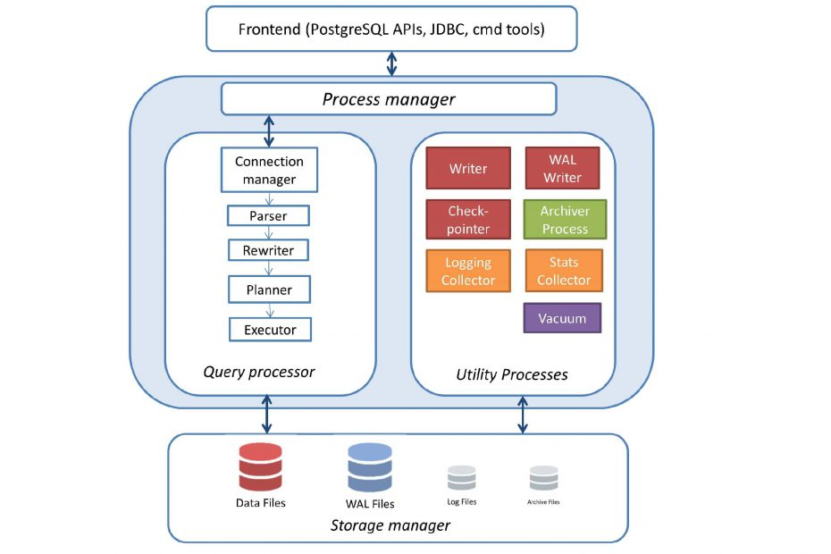

数据库打工仔在擦拭枪支时，喃喃自语的历史八卦

# 模块化设计：AR15 vs. PostgreSQL

## 模块化：独行侠与团队创造

## PostgreSQL
### 历史起因
PG的牛X，它作者的牛X，网上无数硬核也有无数的软文。大家自己找。这个东西是写给自己的，所有copy/paste的划水高招，就懒得使了

面对客户分析那种数据库比较适合业务的时候，为了东家的业务（和自己的炫技），常常会谈到PostgreSQL是**学院派** ，MySQL是**野路子**。 演绎为，MySQL是一帮高手（hacker) 在走江湖的时候，需要解决现实问题，于是写了MySQL来做数据管理；PostgreSQL是某PhD青年讲师，为了展示数据库RDBMS的博大精深，并且为了可以给学生讲解数据库系统的各个部件，开发了一个课件。虽然是演绎，PG作者能获得图灵奖，侧面也反映该系统的理论价值

简单的说，两个学生听说了System R论文和项目(搞数据库的同行们装B的必读书目，论文读不懂，至少要[八卦一下](https://www.researchgate.net/publication/220421331_A_History_and_Evaluation_of_System_R))，说咱们搭个积木练练手，于是写了Ingres。后来觉得不够好，顺手致敬一下"man month mythical - The pilot system and the 2nd system effect"(又是另一个软件工程师装B必读), 重写了一个。名字都不愿意费劲，直接POST(in)GRES了。再后来，又有两个学生需要毕业，顶会刊物论文做KPI，就加了一个语言系统，于是今天的PostgreSQL。

感谢前辈们呀，养活了我们这些靠这大树和平台吃饭的半瓶子醋们 

### 模块架构

公平的说所有的系统产品都是模块化的，即使初期是由某一俩个大牛独立完成(Linux, MySQL), 系统产品必须依赖团队协作才能真正取得成功，也就是所谓的“正规军”协同作战。对于必然要求模块化，即不同团队/个人可以独立开发调试；和接口interface设计，即团队之间的协调。

称为正规军其实是有一定道理的，因为很多现代工业的模式是从军队和战场学来的。[华为就自称军事化管理](https://www.sohu.com/a/241479284_100085094)。接口的巅峰范例就是二次大战是的海陆空协调。模块化更可以追溯到[罗马方阵](https://baike.baidu.com/item/%E7%BD%97%E9%A9%AC%E6%96%B9%E9%98%B5/10008743)时代，两百人队组成一小队，三小队组成一大队，十大队成一军团，于是由60～80人的模块到4～6千人的集团，都有了独立战斗和协调战役的能力。

扯个闲话，工作中我参加过某**战役**的KO，问了一个问题，“多少人力可以投入到这个战役？”，发现与会人不少，真正投入的人力不到3个！用战役来形容这种工作，哎，吹牛都这么卷了。

八卦总要有个边界，收一下图是网上google来的PostgreSQL的架构图，有心情的同学可以[参考](https://distributedsystemsauthority.com/postgresql-high-performance-guide-architecture/)，写的还是不错的。

虽然上图画的是PG, 基本上可以覆盖2/3的传统数据库，因为“天下功夫出少林”。大部分经典数据库都是在System R的系统原型上开发的，IBM的DB2自不必说，传说Larry Ellison当年开发Oracle, 不懂得地方就直接电话System R的作者们。

简单举例一个模块吧： （query)rewrite

* 语法兼容：比如DB2中`TO_CHAR()`和`VARCHAR_FORMAT()`是语法不同但是语意相同的synonym。这样就可以很容易的增强同其他数据库产品的兼容性。PG没有SQL Server的datediff，但是可以通过rewrite 用已有的[原子op支持](https://www.sqlines.com/postgresql/how-to/datediff). 最近AWS推出的Babelfish便是这个原理。

* 优化选项 ：比如`WHERE C1 = 1 or C1 = 2 .... or C1.=10000`  可以重写为 `WHERE C1 IN (1,2,...10000) `。 于是就可以利用专门为`IN`提供的优化逻辑，如presort, binary search.... 

* 类似的还有，transitive closure， query decorelation, etc. 

这里重要的不是能够做什么东西，而是这些这些operation可以在Query Rewrite 模块独立完成，流水线前方的Parser, 和后方的optimizer, executor 侵入性极小甚至无感。 

模块化的反面典型呢，请移步"MySQL is a pretty poor database, and you should strongly consider using Postgres instead" by Steinar H. Hunderson， 尤其针对的就是MySQL SQL引擎的模块化设计问题。当然我们是八卦为主，不做MySQL与PG之争，客户随便选。

### 可扩展性

1. SQL 引擎（vs. MySQL 辞职信）； 2. UDF and Stored proc; 3 FDW vs HAWK; 4. 新数据的支持： JSON  

extension : 
CREATE EXTENSION orafce; 

https://github.com/orafce/orafce
Functions and operators that emulate a subset of functions and packages from the Oracle RDBMS.

There is an associated Google group - https://groups.google.com/forum/?hl=en#!forum/orafce-general

The Orafce is supported in AWS Aurora with PostgreSQL Compatibility and also in Azure Database for PostgreSQL.

### 数据库事务性和Isolation
数据库开发人员面试/晋升答辩必备。除非你是天天围绕事务性的code滚打，被绕进坑里爬不出来的机会非常大。

笔者数据库相关面试没有100，也有50了。自己记性很差，背不过RU, RC, CS RR, SI，Serializable 之间对应的anomalies。让我慢慢根据逻辑推导出来，一般八九不离十。但是面试答辩中的快问快答，就容易晕菜。每次面试之前都要准备一次。 这方面的网上技术文章很多，除了少数有新意的，基本上都是读书笔记水平，个别的把别人的英文blog翻译成中文，直接属上自己的名字。我一般为了防止老年痴呆，偶然看如下三个材料。最常用的是第二个，面试之前临时抱佛脚的：

- [A Critique of ANSI SQL Isolation Levels](https://arxiv.org/pdf/cs/0701157.pdf)。1995年微软研究院出品。直接挑战SQL-92中从表现形式“Dirty Reads, Non-Repeatable Reads, and Phantoms”定义的隔离级别，并且提出Snapshot Isolation概念
- [A Critique of ANSI SQL Isolation Levels - the morning paper](https://blog.acolyer.org/2016/02/24/a-critique-of-ansi-sql-isolation-levels/)。上面经典paper的读书笔记，尤其是它的第一张图把8个异常现象和6个隔离级别画的很清楚
- [CMU Advance Database 课件](https://15721.courses.cs.cmu.edu/spring2020/) by Prof. Andy Pavlo.

对于实现方式，一般是用lock-based锁或者MVCC。不同是实现方式，也就引起上面的隔离级别的分支。分布式集群中的事物的复杂度就指数型上升了。在面试的时候，如果你很牛，可以提出HLC和truetime来炫技，如果一般的话，建议不要给自己挖坑。这个题目是“茴”字四种写法在数据库中的典型反例。

上面写的东西就是凑字数，大家千万不要太认真。主要是为了引出下面的八卦。

#### 八卦一定要认真
回想起七月东京奥运会上，那个洛桑理工的数学女博士后公路自行车比赛超越职业战队，获得金牌的传奇。真说不清什么是专业什么是爱好。

PostgreSQL社区也有这么一位，请看2012 VLDB作品：[Serializable Snapshot Isolation in PostgreSQL](https://arxiv.org/pdf/1208.4179.pdf)。两个作者（兄弟我也混过个顶会paper, 纯粹火锅奖）其中一个作者Kevin的email是从[wicouts.gov](https://www.wicourts.gov/)来的，对，就是威斯康星州法院。

文章中的应用场景是威斯康星州法院的例子
> However, snapshot isolation does not guarantee serializable behavior; it allows certain anomalies [2,5]. This unexpected
transaction behavior can pose a problem for users that demand data
integrity, such as the **Wisconsin Court** System, one of the motivating cases for this work. 

例子中的业务场景是法院的值班医生。限制条件是必须有至少一个医生值班。两位医生Alice and Bob在下班前，先看看值班医生数是否>=2, 如果"yes"，他/她就下班了。如果上图的两个事务(transaction)顺序执行的话，是不会有问题的。但在并发concurrency时，用SI(Snapshot Isolation)的方式，两个T读同一个Snapshot, 返回值是2。结果就是Alice and Bob双双下班回家去，不管病人死与活。

江湖传言说这个Kevin其实是法院下属的监狱系统的，实际场景不是医生，而是狱警。八卦的真谛是坚决不证伪，所以我同客户分享SSI的时候，直接上《Prison Break越狱》，大家可以移步[豆瓣](https://movie.douban.com/subject/1419297/)了

在当时的PostgreSQL实现了SI, 但是无法解决上面的问题。看起来有像一个比较实际的问题，总不能让病人(犯人)病死(越狱)吧，于是一个开源社区产品经理们合计了一下(我编的，社区多采用你牛你上的原则), 2011.9.11 GA [PostgreSQL 9.1 release note](https://www.postgresql.org/about/news/postgresql-91-released-1349/)。

后来同样在PG生态上的分布式TP数据库cockroachDB，也支持同样的[Serializable](https://www.cockroachlabs.com/docs/stable/demo-serializable.html)

上面提到isolation level有6个隔离级别（茴字才四种写法)。事实上，RDBMS常常只用2～3个，PostgreSQL的default是RC，MySQL的default是RR。虽然大部分成熟的关系数据库都有能力提供更高级别的能力，实际业务中常常不需要，或者说买不起，every feature coming with a cost。

虽然我知道保时捷跑车很好，我偏偏喜欢自己的12年新25万公里的本田奇域（穷是俺的生命的原动力）。同客户交流也一样，可以讲牛X的东西，选型是要按合适的来。这篇扯文就是在七年新的Early 2014 MacBook Air 上完成的。

## ArmaLite AR-15 成年人的乐高
这是与AK47系列齐名的突击步枪，民用版一般叫AR-15是半自动的。军用版M4/M16为可选择半和全自动

- 子弹型号： .223 Remington or 5.56 nato （略有差别，常可混用）
- 枪口初速：900米／秒
- 有效射程：500米
- 发明日期：1956
- 军用服役年代：1964～至今（M16）， 1987～～至今（M4）
- 第一场主要战争：越南战争
- 数量：AR-15: 美国平民5～10百万; 军用M4卡宾50万；军用M16 8百万

WII 美军的主力步兵武器 M1 Garand，二战之后升级为同样.30口径的M14。
.30口径包括.30-06和.308(7.62X51mm NATO)，属于大口径步枪子弹。
M14是韩战和越战早期(越战正式开始时间有不同的说法，这里采用1955.11.01) 的主要步兵武器
在越战中面对新研制的中口径步枪AK47(7.62×39mm)，M14虽然子弹动能大，有效距离远(800+ with scope)， 
但是在实战中暴露了对于AK47的弱势。大口径子弹在全自动情况下步兵无法掌控后坐力（第二发就完全上天），
携弹量少无法保证火力压制，同时着弹后多为穿透伤
在这种情况下，决定开发与AK47类似的中口径步枪
 
### Modularity
### 出初战受挫
### 计算和储存分离
## THE END

