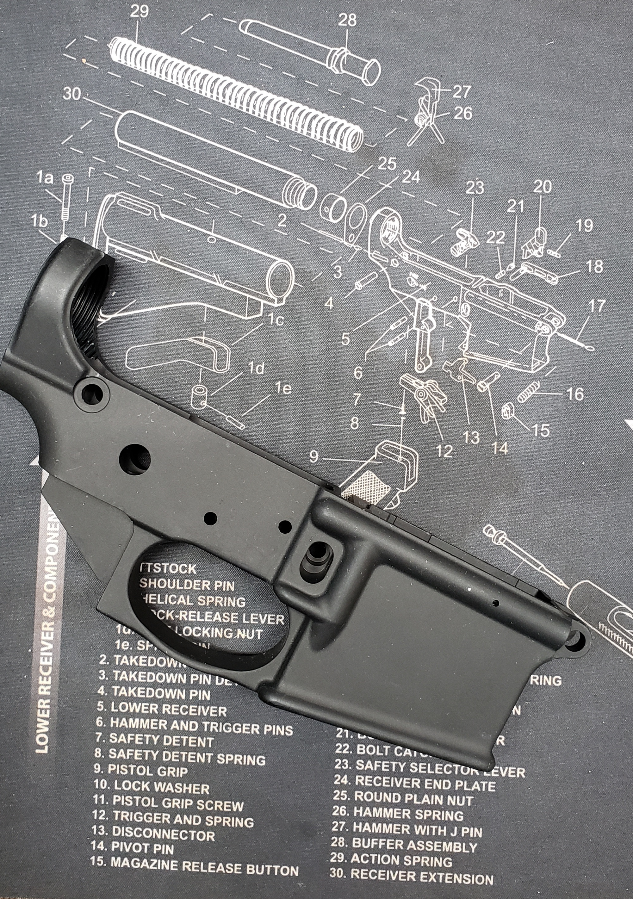
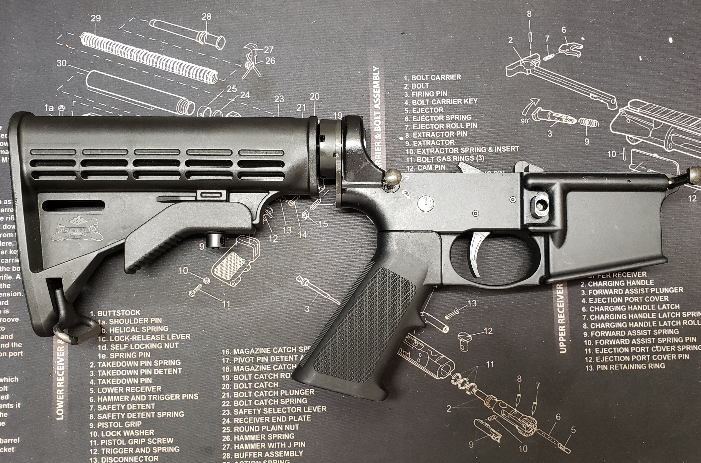
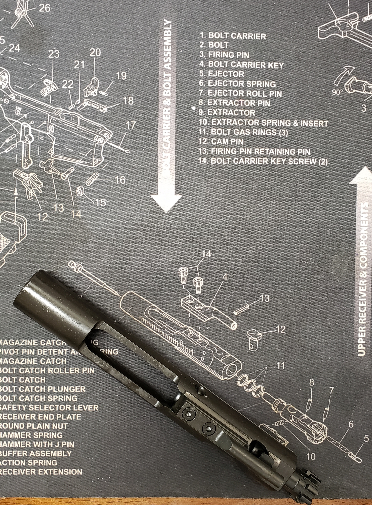
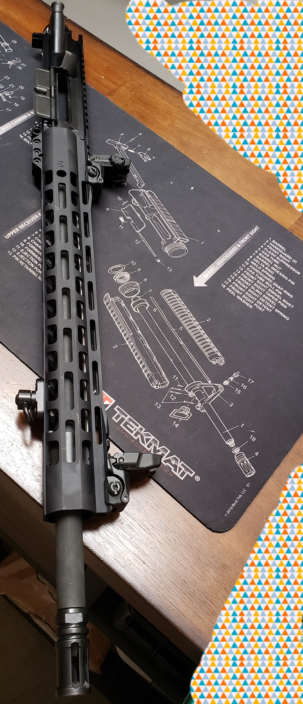
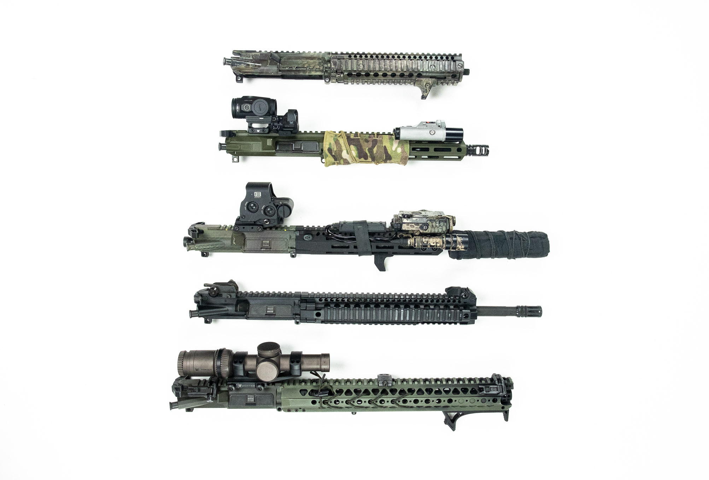

数据库打工仔在擦拭枪支时，喃喃自语的历史八卦

# 模块化设计B：AR15 vs. PostgreSQL

## ArmaLite AR-15 成年人的LEGO
这是与AK47系列齐名的突击步枪，民用版一般叫AR-15是半自动的。军用版M4/M16为可选择半和全自动

- 子弹型号： .223 Remington or 5.56 nato （略有差别，常可混用）
- 枪口初速：900米／秒
- 有效射程：500米
- 发明日期：1956
- 军用服役年代：1964～至今（M16）， 1987～～至今（M4）
- 第一场主要战争：越南战争
- 数量：AR-15: 美国平民5～10百万; 军用M4卡宾50万；军用M16 8百万

WII 美军的主力步兵武器 M1 Garand，二战之后升级为同样.30口径的M14。
.30口径包括.30-06和.308(7.62X51mm NATO)，属于大口径步枪子弹。

### 1. 业务需求
M14是韩战和越战早期(越战正式开始时间有不同的说法，这里采用1955.11.01) 的主要步兵武器
在越战中面对新研制的中口径步枪AK47(7.62×39mm)，M14虽然子弹动能大，有效距离远(800+ with scope)， 
但是在实战中暴露了对于AK47的弱势。大口径子弹在全自动情况下步兵无法掌控后坐力（第二发就完全上天），
携弹量少无法保证火力压制，同时着弹后多为穿透伤
在这种情况下，决定开发与AK47类似的中口径步枪。

我没有30-06的，网上盗图一种，给大家个视觉感觉三种子弹的体量。

因为子弹的重量变化较大，我没有找到具体军用子弹重量的数字。
根据我自己装填的数据换算为： 

| 子弹口径                     | 单重 (gr)  | 每公斤  | 典型器械             |
|:------------------|:--------|:-------|:-------------|
| 5.45×39mm                | 168         | 92        | AK74 
| **.223Rem/5.56**            | 194          | 80        | AR-15， M16， M4 
| 7.62X39mm                | 253         | 61        | AK47/中国五六冲, SKS/中国五六半        
| .308 Win 7.62×51mm   | 395         | 39      | M14 , Springfield M1A, Remington 700| 
| .30-06                      |       403         |       38     | M1 Garand   |

注1：1kg = 15432grain

注2：笔者没有30-06， 数字是网上查的

**系统设计始终忠于业务场景**

0. 可靠性，易维护
1. 中短距离： 50～500米
2. 在有效口径内的携带量：中小口径步枪
3. 压制火力：半/全自动
4. 量产：原材料要求低，可以标准化生产
5. 精准度：枪管质量，子弹质量
6. 可插拔性：便于外挂设备，产品升级和扩展

AR-15和AK47系列都具备上述条件。AK47在量产压倒性领先，AR-15在精准度和可插拔性要有明显优势。可靠性和易维护是must-have, AK47优胜一筹
 
### 2. 模块架构设计
AR-15由两大部分组成： lower receiver and upper，与云原生数据库的计算和储存分离有点类似。这两大部分，有可以细分为3个模块。

这里的一些名词就不翻译成中文了。否则很容易外国人看不懂，中国人不明白

#### 2.1 Lower Receiver （completed) 下机匣 
这是步枪的制动装置，最主要的核心是机匣部分，作为系统中心，整合枪栓、扳机、火控、弹匣、枪托等其它枪械部件。

上图的这块黑东西就是下机匣。在美国它是被管控的，也是唯一一个部件不可以直接网购的（此陈述只针对在此时2022，此地加州）。
这里歪个楼，如果有读者希望了解美国的话，拥枪法是一个非常好的切入点（还有选举法，大麻法，同性婚姻法）。

列表中的30个部件组装在一起叫做completed lower。除了机匣外，所有的部件都可以网购。当然也可以直接买组装好的。
不过谁买已经拼好的LEGO？而且枪托，板机都有不同组合，玩家自己搭积木的居多。
我搞的第一把花了4个小时，第二个就只用不到一个小时。熟练工是20分钟齐活

#### 2.2 Bolt Carrier Group
就是枪栓了。我前面曾经提到过莫辛-纳甘步枪是手动bolt action, 它的枪栓相对简单。
而AR-15的枪栓的复杂度和精密度要求就高了许多，手工打造是比较难的。
比如撞针系统，每次触发都要保证有足够的动力，保证底火出发成功，即可靠性。非触发时，撞针不应该有松动，以避免事故发生
同时枪栓是整个器械动作最频繁和动能最大的部件，必需保证润滑，材料抗磨损，以保证上万次无失误。
枪栓没有太多的变化（质量当然有好坏之分），所有大多直接现货了，组装的很少。

#### 2.3 Upper Receiver & Barrel & Handguard
Upper Receiver上机匣，故名思义，就是在下机匣上面的拼砖。上面提到的枪机组件（bolt carrier group）就在上机匣里，同时也连接枪管，装瞄准镜的导轨也是标配。一般军用是Picatinny rail标准。Weaver rail是另一个常见的。此导轨在民用AR-15是标配，因为大家一般会“加盖”瞄准镜，红点，或者更精确的铁锚。有这个导轨就很容易外挂了。下图里就是加持的铁锚。

Barrel 是另一个关键组件。它内部的膛线，就是Rifle名字的由来，来复线的转率决定子弹头的效率。
如果今天我们称芯片，操作系统，数据库等是高科技的话。“无缝钢管”就是100年前工业高科技的代表，覆盖石油、化工、钢铁、机械、军工、航空航天方方面面。一把AR-15的准确度主要来自这个管子。想想看，从原材料，到冶金工艺，都影响枪管对温度的敏感和抗磨损的能力。当然内部口径的精度也直接影响出膛后子弹的飞行稳定。

Handguard主要的功能是围在枪管外绝热，手可以扶在上面保持稳定。它也作为辅助平台，可以外挂背带，手电筒，双脚架、战术灯、激光瞄准具、夜视仪等等。

常常这几个部件被组装一起统称为completed Upper。 

### 3. 出初战受挫
AR-15在早期的时候并没有被前线认可。当在越南战场用M16替代M14的时候，很多前线士兵写信给他们的父母，提到这个新武器有多么不靠谱。那些父母们当然去找他们的议员，要求听证，当时议会和FBI都启动了正式的调查。无聊的同学可以参考，1967年的政府报告[Report of the Special Subcommittee on the M-16 Rifle Program of the Committee on Armed Services House of Representatives](https://archive.org/stream/M16IchordReport1/M16%20Ichord%20Report%201_djvu.txt)。对了这个link是个非盈利组织，也是open source世界的一部分。

主要原因有几方面吧，从前线士兵角度来说，这是一个新武器，他们不太有信心，谁想当小白鼠呀。同时把从中大口径的.30的子弹换到小口径的.22，给人感觉是火力小了，力量不够。同时这个武器系统是私人公司设计的，不是军方设计的，所以有一种天生的不信任感。

除了心理作用以外，另一个主要的原因是早期的确有些缺陷的，最明显的就是它容易卡壳，军队收到许多前线士兵的反馈（和怒骂），其中一个
> ..I know of at least two Marines who died within 10 feet of the enemy with jammed rifles...
所幸的是通过提供更好的维护设备（擦枪的东西）和改变火药解决了这个问题。

### 4. 计算和储存分离
上面提到的upper和lower提供了比较好的模块分解。lower可以升级变化的不多，除了枪托外，最需要升级的就是板机。
而lower的范围可是多了，尤其在枪管长度上，从7寸9寸的短突，到14.5寸的M4/M16标准军用突击步枪，到18寸20寸的中距离狙击枪。并且可以根据业务用途，安装不同的附件。比如M16一般用铁锚或红点，几十到200米距离够用了，长的加好的scope，4～500米上靶子。
下面是网上搜的一些

### 5. others
* 扩展性： AR平台是针对556子弹设计的。借助其模块化设计，现在覆盖多种流行的弹药，比如308的AR-10，9mm的AR-9, 也可以适用7.62X39mm和5.45X39mm， AR-15可以装个转换器支持22lr
* 

## THE END

